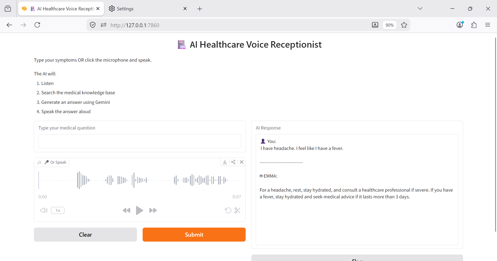

# 🏥 AI Healthcare Voice Receptionist

An AI-powered Healthcare Voice Receptionist built using **Python, Google Gemini, Retrieval-Augmented Generation (RAG), FAISS, Whisper, and Gradio**.

 This AI Receptionist is an intelligent healthcare assistant capable of understanding patient symptoms through text or voice, retrieving relevant medical information from a knowledge base, generating context-aware responses using Google's Gemini LLM, and speaking the response back to the user.

---

# 🚀 Features

* 🎤 Voice Input using Whisper
* ⌨️ Text Input
* 🧠 Retrieval-Augmented Generation (RAG)
* 📚 Medical Knowledge Base
* 🔎 Semantic Search using FAISS
* 🤖 Google Gemini 2.5 Flash
* 🔊 AI Voice Responses using Google Text-to-Speech (gTTS)
* 🌐 Gradio Web Interface
* 💻 Terminal Version with Complete Voice Pipeline

---

# 🏗️ System Architecture

```text
             User
        (Voice / Text)
               │
               ▼
      Speech-to-Text (Whisper)
               │
               ▼
         User Medical Query
               │
               ▼
 Sentence Transformers Embeddings
               │
               ▼
      FAISS Vector Database
               │
               ▼
 Retrieve Relevant Medical Context
               │
               ▼
     Google Gemini 2.5 Flash
               │
               ▼
       AI Generated Response
               │
               ▼
 Google Text-to-Speech (gTTS)
               │
               ▼
          🔊 Voice Response
```

---

# 🛠️ Tech Stack

| Category                | Technology                               |
| ----------------------- | ---------------------------------------- |
| Programming Language    | Python 3.11                              |
| Large Language Model    | Google Gemini 2.5 Flash                  |
| Prompt Engineering      | Custom Prompt Templates                  |
| RAG Framework           | LangChain                                |
| Vector Database         | FAISS                                    |
| Embeddings              | Sentence Transformers (all-MiniLM-L6-v2) |
| Speech-to-Text          | OpenAI Whisper                           |
| Text-to-Speech          | Google Text-to-Speech (gTTS)             |
| Web Interface           | Gradio                                   |
| AI Libraries            | Transformers, Hugging Face               |
| Environment Variables   | python-dotenv                            |
| Knowledge Base          | Custom Medical Dataset                   |
| Development Environment | Visual Studio Code                       |
| Version Control         | Git & GitHub                             |
| Operating System        | Windows 11                               |

---

# 🧠 Core AI Concepts Used

* Retrieval-Augmented Generation (RAG)
* Prompt Engineering
* Semantic Search
* Vector Embeddings
* Similarity Search
* Large Language Models (LLMs)
* Conversational AI
* Voice AI
* Speech-to-Text (STT)
* Text-to-Speech (TTS)

---

# 📂 Project Structure

```text
ai-healthcare-voice-receptionist/
│
├── app.py
├── ui.py
├── requirements.txt
├── README.md
├── .env
│
├── audio/
│
├── data/
│   └── medical_data.txt
│
├── llm/
│   └── gemini.py
│
├── rag/
│   ├── embedder.py
│   └── retriever.py
│
├── voice/
│   ├── speech_to_text.py
│   └── text_to_speech.py
││
└── src/
    └──web_screenshot.png
```

---

# ⚙️ Installation

## Clone the Repository

```bash
git clone https://github.com/YOUR_GITHUB_USERNAME/ai-healthcare-voice-receptionist.git

cd ai-healthcare-voice-receptionist
```

---

## Create a Virtual Environment

### Windows

```bash
python -m venv venv

venv\Scripts\activate
```

### Linux / macOS

```bash
python3 -m venv venv

source venv/bin/activate
```

---

## Install Dependencies

```bash
pip install -r requirements.txt
```

---

## Configure Environment Variables

Create a `.env` file in the project root.

```env
GOOGLE_API_KEY=YOUR_GEMINI_API_KEY
```

---

## Build the Vector Database

```bash
python app.py
```

---

## Launch the Web Application

```bash
python ui.py
```

Open your browser and visit:

```
http://127.0.0.1:7860
```

---

# 📸 Screenshots

## Home Screen



---


# 💡 How It Works

1. User enters a medical query through text or voice.
2. Voice input is converted into text using Whisper.
3. The query is converted into embeddings using Sentence Transformers.
4. FAISS performs semantic similarity search.
5. The most relevant medical context is retrieved.
6. Retrieved context and the user's query are sent to Google Gemini.
7. Gemini generates a context-aware response.
8. The response is displayed in the interface.
9. The response is spoken aloud using Google Text-to-Speech.

---

# 🔮 Future Improvements

* Multi-turn Conversations
* Appointment Booking
* Electronic Health Record (EHR) Integration
* Azure Cloud Deployment
* Docker Support
* REST API
* Voice Activity Detection
* Authentication & Authorization
* Medical PDF Upload
* Clinical Safety Guardrails
* Conversation History
* Streaming Responses
* Multilingual Support

---

# 📚 Learning Outcomes

Through this project, I gained hands-on experience with:

* Large Language Models (LLMs)
* Prompt Engineering
* Retrieval-Augmented Generation (RAG)
* LangChain
* FAISS Vector Database
* Sentence Transformers
* Google Gemini API
* Whisper Speech Recognition
* Google Text-to-Speech
* Gradio
* End-to-End AI Application Development

---

# ⚠️ Disclaimer

This project is intended for educational and demonstration purposes only. It should not be used as a substitute for professional medical advice, diagnosis, or treatment.

---

# 👨‍💻 Author

**Abhihail Jacob**

AI / Machine Learning Engineer
